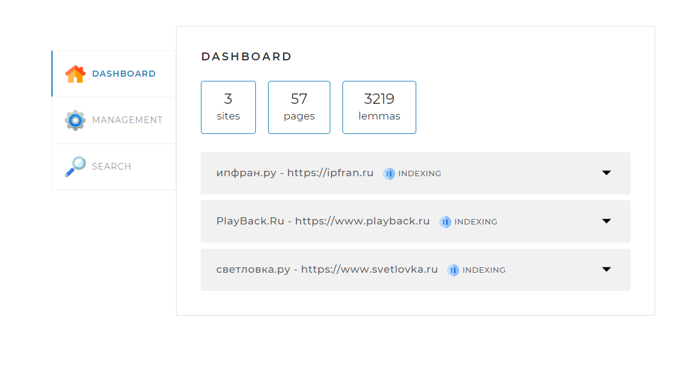
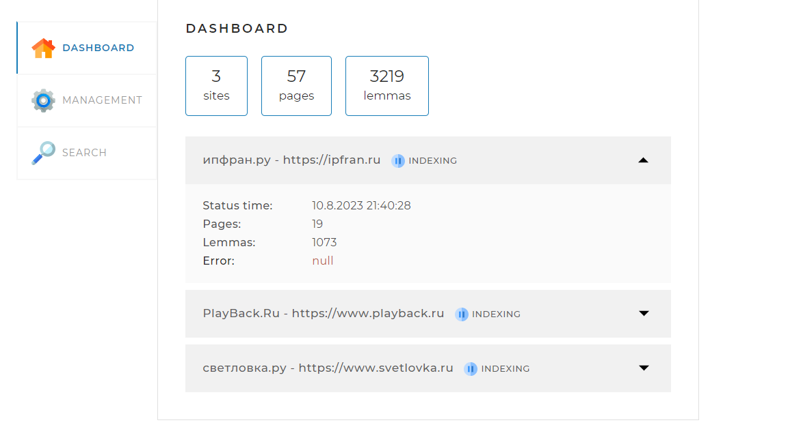
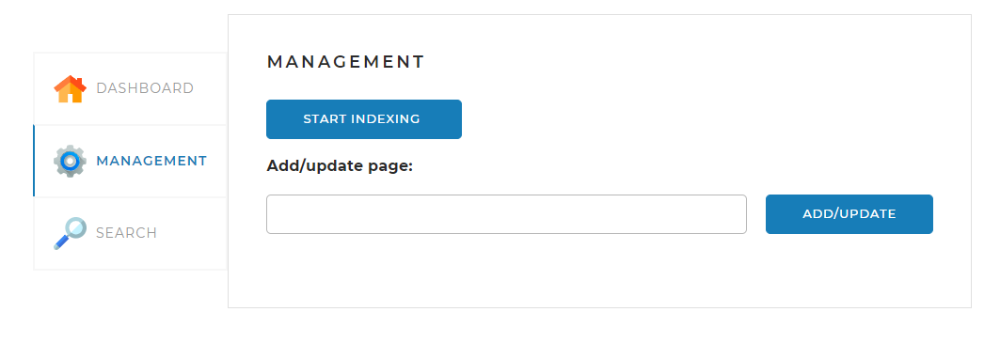
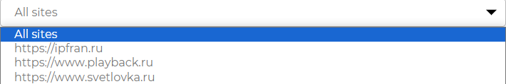

<h1 align="center">SearchEngine</h1>

____
<h2 align="center"><a  href="http://localhost:8080/">USE DEMO</a></h2>
____
### _I. Description_

Search engine is my first small serious project which is implemented in java. Application that allows you to index pages and perform quick searches on them

The engine has three modes of operation: Dashboard, Management, Search.

1) Dashboard - is an introductory mode that allows you to see how many sites for indexing are taken into account, what is the total number of pages and lemmas.

   Lemma is the initial, dictionary form of a word.
   If in this mode on this page you click below on a specific site from the list, 
you can see data on it such as: indexing status (indexing, indexed or failed)
last change status, the number of pages on it and the Lem, 
as well as the presence of an error.

   

2) Management - in this section, indexing is started using 
the corresponding key  ,
   if you write the page address in the appropriate field and click the button

   then the list of lemmas will be updated at this address or if the 
address has not been indexed before, then it will be added to the database.

   

3) Search - here you can find pages by word or phrase. 
The search can be carried out both on all sites and on a specific. 

then enter a word or phrase in the query field and use the button 
.
Below, after some time you can see the result

____
### _II. Java technologies used_

When creating the logic of this project, 
almost all the basic technologies and java libraries were used.
In addition, in order to make it easier to 
create a web application, it was decided to use the Spring Framework assembly.

In general, the stack of technologies and libraries used is as follows:

- Maven
- OOP (inheritance, encapsulation and polymorphism)
- Cycles
- Collections and Maps
- Streams
- Using annotations
- Multithreading (normal and recursive)
- Working with exceptions
- Interfaces, Classes and their methods for working with the database
- Spring framework and its features
- Using the service layer of the application to interact with the client 
interaction area (front) and application logic
- Lematization of words

____
### _III. Instructions for running the project locally_

To successfully launch the application, you must do the following procedure:
1. Go to the command line with commands according to your OS;
2. Go to the folder where the file with the jar extension (with the project) and t
he configuration file called application.yaml is located;
3. Enter the following command to launch the application: "java -jar searchengine.jar";
4. If the above steps are done correctly, 
then in order to test all the features of the application, 
you need to go to the site http://localhost:8080/ or use the link above (USE DEMO).

